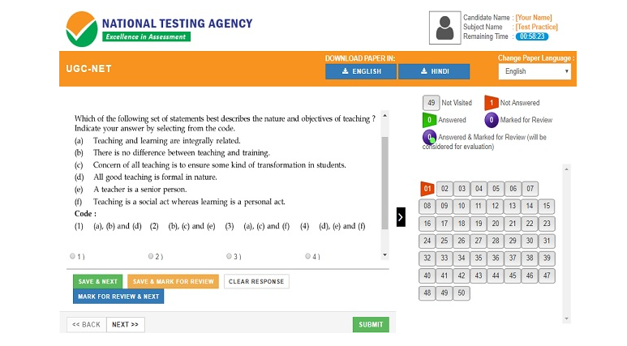

## 1. Instructions

In this assignment, we would be analyzing the UI/UX skills and  of a given image and identifying key,
areas that can be enhanced to improve the user experience.

### A. Image 
 - The image we will be using for this assignment is shown below:

,

- Create a Login and SignUp page for that.

## 2. Guidelines and Submission
 - Use git for code management
 - Submit your code on a Github repository.  
 - Include a README file that describes your application and how to run it.  
 - Include screenshots or a video of your application in action.  
 - Submission timeline: 24 hrs 
 

## 3.  Analysis:
 - After analyzing the image, we have identified the following key areas that can be enhanced to improve the UI/UX. 
 - In conclusion, by enhancing the navigation,  buttons,  images,  information, and  section.
 - we can greatly improve the UI/UX of the given image and provide a better user experience for user.